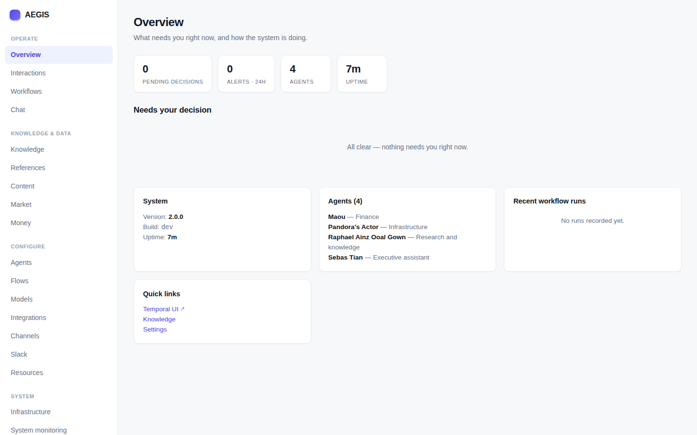
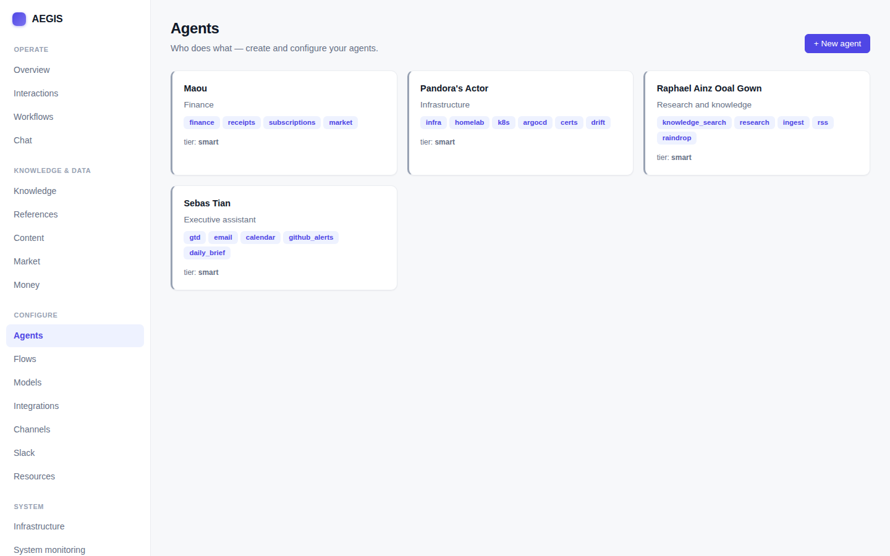
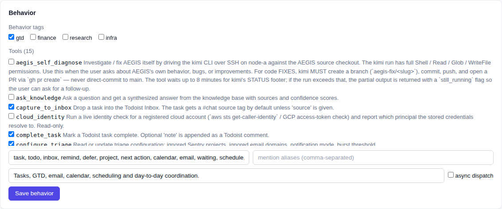

# AEGIS

[](https://github.com/hikmahtech/aegis/actions/workflows/core.yml)
[](https://github.com/hikmahtech/aegis/actions/workflows/worker.yml)
[](LICENSE)
[](https://www.python.org/)
[](https://hikmahtechnologies.com/aegis)

**Autonomous Executive Guild Intelligence System** — a flow-first, self-hosted
personal AI orchestration platform. A small fleet
of named agents run scheduled and event-driven workflows over your own data —
GTD/tasks, money, knowledge, homelab alerts — and ask you for a decision only
when they actually need one. Local-LLM-first: it runs against your own models
through a LiteLLM proxy, and can reach for Claude or OpenAI when you want the
extra horsepower.

> This is a personal project, built to be **forked and configured for your own
> life** — not a multi-tenant SaaS. The shipped agents, schedules, and
> personalities are the maintainer's working example; you replace them with
> yours. MIT licensed.

**Project home & story:** [**hikmahtechnologies.com/aegis**](https://hikmahtechnologies.com/aegis)
— an overview of how AEGIS works, plus a series of essays on how it was built.

## What it does

- **Agents, not a chatbot.** Four personalities (an assistant, a researcher, a
  money agent, an infra/ops agent) each own a slice of your life. Routing
  between them is data-driven (per-agent keywords/tools in the DB, not hardcoded).
- **Flows do the work.** ~30 Temporal workflows on a schedule or trigger:
  triage email, mirror your task manager, sweep subscriptions, watch a Google
  Drive folder, investigate alerts, build a daily brief.
- **Human-in-the-loop, budgeted.** When an agent needs a decision it sends a
  card to your chat channel; you Approve / Edit / Reject. A daily
  **notification budget** keeps proactive pings from becoming noise.
- **Memory that learns.** When you correct an agent (resolve a card with a
  reason), that correction becomes a durable lesson surfaced in the agent's
  next prompt.
- **Your knowledge, local.** A native Postgres + pgvector RAG store. Seed it
  from URLs, uploads, server folders, or a watched Drive folder. Embeddings run
  on a free local model — no per-token cost.
- **Your infrastructure, registered.** An infrastructure registry holds SSH
  hosts, your Docker Swarm, Kubernetes clusters, cloud accounts (AWS / GCP),
  and the coding-agent host — credentials pasted in the admin UI, encrypted in
  the DB, with per-entry read-only gating for the ops the agents may run. A
  **System monitoring** page shows the health of AEGIS's own services (scoped
  to its own stack, so a shared swarm stays legible).
- **Agents that write code.** Register your repos and a coding host in the UI —
  SSH identity plus **Claude Code / Kimi** engines, named Claude accounts, and
  per-GitHub-org routing. The ops agent SSHes in and runs the CLI on the right
  repo, on the right account, to investigate alerts and propose fixes; Sentry /
  alertmanager issues resolve to the matching repo automatically.
- **Market data without a vendor contract.** A provider-agnostic finance
  connector (keyless Yahoo / Stooq) backs the money agent's quotes, market
  overview, and finance news.
- **Configured in the UI, not in YAML.** Agents, personalities, channels,
  schedules, integration secrets, the LLM backend, and infrastructure are all
  DB-owned and edited in the admin panel; seed files and env vars are
  first-boot bootstrap only. Slack (Socket Mode) is the optional chat channel —
  the web Interactions inbox always works.

## Screenshots

The admin panel is where you configure and operate everything — no config files
to hand-edit. Shown below with the shipped example agents and seed data.

| Overview | Agents |
|---|---|
|  |  |

Each agent's behavior is data-driven — capability tags and its tool set are
ticked in the UI, not hardcoded:



## Architecture

Three Python packages in one repo:

| Package | Role |
|---|---|
| `aegis-core` | FastAPI API (port 8080) + the admin SPA, chat, knowledge, connectors |
| `aegis-worker` | Temporal worker — all the flows and activities |
| `aegis-comms` | Chat channel bot + delivery server (Slack adapter) |

Backed by **Postgres 16 + pgvector** (migrations auto-apply on core startup),
**Temporal** for durable workflows, and a **LiteLLM proxy** that resolves
`fast` / `balanced` / `smart` model tiers to whatever models you point it at.

Full design: [`docs/architecture/overview.md`](docs/architecture/overview.md).

## Quick start

One command brings up Postgres+pgvector, Temporal, and the core API + worker:

```bash
cp config/.env.example config/.env   # set AEGIS_ADMIN_USERNAME / _PASSWORD
docker compose up -d                 # core (:8080) + worker + postgres + temporal
```

Then open **http://localhost:8080** (the admin panel) and:

1. **Models & Providers** → pick your LLM backend — a hosted key (Claude / OpenAI /
   OpenRouter) or a local one. For fully-local, run `docker compose --profile
   local-llm up -d ollama` then `docker exec aegis-ollama ollama pull <model>` and
   point the base URL at `http://ollama:11434/v1`.
2. **Agents** → tweak the agents, or create new ones (with **Draft with AI**).
3. **Flows** → enable the scheduled flows you want.

Cards that need a decision land in the **Interactions** inbox — no chat app
required. Slack is optional and configured in the admin panel under
**Configure → Slack** (tokens are encrypted in the DB); the comms service runs
with or without it, idling as a no-op until it's configured. For local dev you
can still pass `AEGIS_SLACK_*` env vars and `docker compose --profile slack up -d`.

For Python development (running the services from source) see
[`docs/development.md`](docs/development.md).

## Configure it for yourself

The system is seeded from plain YAML + Markdown — edit these, not code:

- `config/seed/agents.yaml` — your agents (names, model tier, routing metadata, channel)
- `config/seed/activities.yaml` — the scheduled flows (cron, agent, config) — also editable live from the admin panel at `/admin/flows`
- `config/seed/{channels,resources,todoist}.yaml` — channels, tracked resources, task projects
- `personalities/<agent>/{SOUL,AGENTS,USER,MEMORY}.md` — starter persona examples, imported once on first boot; afterwards each agent's persona is edited live in the admin panel and stored in the database
- `config/.env` — secrets and endpoints (gitignored; never commit real keys)

The admin panel (served by core at `/`) is the visibility surface: flows,
interactions, knowledge, Google integrations, notification budget.

## Tests

```bash
docker compose up -d postgres        # real Postgres on :25432 for tests
pytest                               # asyncio_mode=auto
ruff check .
```

## Deployment

This repo's CI is **test-only** — lint + tests on every push/PR, no image build
and no deploy. So a fork's CI just validates your changes and never touches
infrastructure you don't have.

Image build + deploy are kept in a **separate, private infra repo** (Ansible),
so nothing about the maintainer's registry or cluster lives in the open-source
repo. That side builds the three images from a checkout of this repo
(`core/`, `worker/`, `comms/` Dockerfiles — the core image builds the admin
panel itself in a Node stage, no separate pre-build step needed) and rolls
them onto a Docker Swarm (`docker stack deploy`, then `docker service update
--force` to pick up a freshly-pushed `:latest`).

To deploy your own fork, wire those same two halves however you like — the
specifics (build args like `EXTRA_CLOUD_CLIS`, migrations, config plane) are in
[`docs/production.md`](docs/production.md). Integration secrets (Slack, Todoist,
GitHub, …) are entered in the admin panel and stored encrypted in the DB — they
are **not** baked into images or committed to config.

## License

MIT — see [`LICENSE`](LICENSE).
