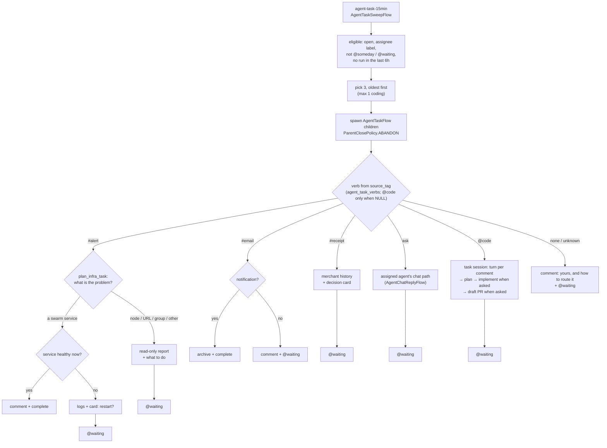
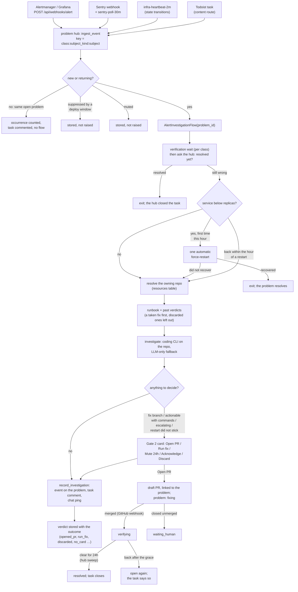

# How AEGIS works — an operator's guide

This is the guide to *running* AEGIS: the mental model, what fires when, how the
agents decide things, and what to check when a run looks green but did nothing.
It assumes you have a working deployment — for setup see
[`development.md`](development.md) (from source) and
[`production.md`](production.md) (images + backing services), and for the full
component reference see [`architecture/overview.md`](architecture/overview.md).

Sections:

1. [The mental model](#1-the-mental-model)
2. [Agents and capability tags](#2-agents-and-capability-tags)
3. [What runs when](#3-what-runs-when)
4. [The GTD / Todoist model](#4-the-gtd--todoist-model)
5. [The agent task executor](#5-the-agent-task-executor)
6. [Human-in-the-loop: interactions](#6-human-in-the-loop-interactions)
7. [The alert pipeline](#7-the-alert-pipeline)
8. [Operating it](#8-operating-it)
9. [Extending it](#9-extending-it)
10. [Failure modes worth recognising](#10-failure-modes-worth-recognising)

## 1. The mental model

AEGIS is a small fleet of named agents running scheduled and event-driven
[Temporal](https://temporal.io) workflows over your own data — tasks, email,
money, knowledge, infrastructure — and asking you for a decision only when one
is actually needed. Three long-running services:

| Service | Package | What it does |
|---|---|---|
| **Core** | `aegis-core` (`core/`) | FastAPI API on :8080, serves the admin SPA, chat with tool calling, the Postgres+pgvector knowledge store, all connectors, and applies DB migrations on startup |
| **Worker** | `aegis-worker` (`worker/`) | The Temporal worker — every flow and activity, on task queue `aegis-main`; reconciles Temporal schedules from the `activities` table (`schedule_sync.py`) |
| **Comms** | `aegis-comms` (`comms/`) | Chat-channel bot + delivery server on :8081 (Slack Socket Mode); idles as a no-op until Slack is configured — the admin **Interactions** inbox always works |

Behind them: **Postgres 16 + pgvector** (the only durable store), **Temporal**
(workflow orchestration, UI on :8233), and an LLM backend resolved through
`fast` / `balanced` / `smart` tiers (`config/models.yaml`, configured live on
the admin **Models & Providers** page).

**Why Temporal instead of cron.** Most of what AEGIS does is not
fire-and-forget. A flow that finds an unhealthy service posts a card asking
"restart it?" and then *waits* — possibly for days — before acting on your
answer. A cron job that asks a question and exits loses the question. A
Temporal workflow is durable state: it survives worker restarts and redeploys,
resumes exactly where it paused, retries individual activities with
per-activity policies, records a replayable history you can inspect in the
Temporal UI, and can spawn child workflows it deliberately does *not* wait for
(`ParentClosePolicy.ABANDON`) so one unanswered question never blocks the next
scheduled tick.

**Where configuration lives.** The DB, edited through the admin UI. The YAML
under `config/seed/` and the markdown under `personalities/` are first-boot
seeds only — after that, agents, personalities, channels, schedules,
integration secrets, and the infrastructure registry are all DB-owned, and
editing the files on a live install has no effect. The one env-side exception
is bootstrap: `AEGIS_DATABASE_URL`, admin credentials, `AEGIS_SECRET_KEY`
(encrypts every DB-stored secret — set it in production), and the Temporal/
comms endpoints.

## 2. Agents and capability tags

The shipped fleet (from `config/seed/agents.yaml`) is a working example — the
point of the project is that you replace it with your own:

| Agent | Role | Behavior tag |
|---|---|---|
| **Sebas** | Executive assistant — GTD, email, calendar, reviews | `gtd` |
| **Raphael** | Research and knowledge — briefings, ingest, scans | `research` |
| **Maou** | Finance — money mail into the hledger books, the weekly brief and the monthly close, market data | `finance` |
| **Pandora's Actor** | Infrastructure — alerts, swarm/k8s, coding runs | `infra` |

(There is also an inactive virtual `system` agent that only exists to satisfy a
foreign key for system-level dispatch logging — never delete it, never chat
with it.)

**Nothing branches on an agent's id.** Behavior is keyed on
`agents.capabilities` — a JSONB list of tags from the closed vocabulary in
`core/src/aegis/agent_tags.py`: `gtd`, `finance`, `research`, `infra`. Code
that needs "the finance agent" calls `services/agents.py::resolve_tag`
(core) or the `AgentRegistryActivities.resolve_agents` activity (worker —
workflows can't touch the DB). If no active agent holds a tag, the feature
**skips with a logged warning** rather than crashing — which is also a failure
mode to know about (see [§10](#10-failure-modes-worth-recognising)).

Per-agent routing knobs live in `agents.metadata`:

| Key | Effect |
|---|---|
| `intent_keywords` / `intent_description` | chat message routing to this agent |
| `mention_aliases` | how the agent is @-addressed in chat, Slack, and Todoist labels (default `[id]`) |
| `tool_set` | which chat tools this agent may call |
| `async_dispatch` | Slack replies dispatched async vs inline |
| `knowledge_domains` | RAG result boosting for this agent |
| `voice_lines` | optional TTS persona lines |

**To add or re-point an agent:** create it on the admin **Agents** page (or
`POST /api/agents`), write its persona, then on the **Behavior** tab tick the
capability tags and pick the tool set. No code changes — every tag-driven
feature (reviews, briefings, money processing, alert investigation, Slack
@-addressing) follows the tags automatically.

Two ownership rules that bite people:

- `capabilities` and `metadata` are **DB-owned once non-empty**. The seed YAML
  applies on first boot and merges *new* metadata keys on upgrade, but a new
  capability tag added to the YAML does **not** retroactively apply to an
  existing deployment — tick it once in the Behavior tab.
- `metadata.tool_set` in the DB **overrides** the `AGENT_TOOL_SETS` dict in
  `core/src/aegis/services/chat.py` at runtime. That dict is only a seed-time
  default for the four example agents; an agent with no configured tool set
  falls back to a minimal read-only `_FALLBACK_TOOL_SET`. So "I added the tool
  to the Python dict and nothing changed" almost always means the DB row won.

## 3. What runs when

The `activities` table drives Temporal schedules: on startup and every ~300s,
`schedule_sync` (worker) reconciles Temporal's schedule list against active
rows — create, update, delete orphans. The schedule id **is** the
`activities.slug`. Because the reconcile loop fingerprints each schedule's
config, an edit to `activities.config` (admin **Flows** page, or
`PATCH /api/admin/activities/{slug}`) **propagates to the live schedule within
~5 minutes, no redeploy**.

The shipped schedule set (`config/seed/activities.yaml` — all crons UTC):

**Minutes-cadence**

| Slug | Cron | Flow | Agent | What it does |
|---|---|---|---|---|
| `infra-heartbeat-2m` | `*/2 * * * *` | `InfraHeartbeatFlow` | Pandora's Actor | Polls swarm nodes + services; spawns an investigation on **state transitions only**, so steady state costs nothing |
| `todoist-sync-5min` | `*/5 * * * *` | `TodoistSyncFlow` | Sebas | Incremental Todoist Sync API pull + drains the `todoist_outbox` write queue |
| `hub-sweep-5m` | `3-58/5 * * * *` | `HubSweepFlow` | Pandora's Actor | The problem hub's housekeeping: opens a `suppressed` problem once its deploy or maintenance window passes, resolves a problem whose task you completed, settles merged fixes (resolves a `verifying` problem once its alert has stayed clear for `fix_verify_hours`, reopens one it came back to), brings every task up to date with its problem, and folds three or more problems of one class into a group when a model call agrees they are one condition |
| `social-publish-5min` | `*/5 * * * *` | `SocialPublishFlow` | Sebas | `@publish`-labelled tasks due now → approval card → post. Ships **inert**: `social_publishing_enabled` defaults to false |
| `gtd-clarify-15min` | `*/15 * * * *` | `ClarifyFlow` | Sebas | Classifies unprocessed Inbox tasks (≤ 20 per tick) |
| `llm-spend-guard-15min` | `*/15 * * * *` | `LLMSpendGuardFlow` | Pandora's Actor | Rolling-24h token **or dollar** budget → flips the LLM kill switch. **Inert** until one is set (both default to 0) |
| `agent-task-15min` | `*/15 * * * *` | `AgentTaskSweepFlow` | Pandora's Actor | Executes agent-assigned Todoist tasks — see [§5](#5-the-agent-task-executor) |
| `sentry-poll-30m` | `*/30 * * * *` | `SentryPollFlow` | Pandora's Actor | Sentry issue poll — safety net behind the webhook fast path |

**Hourly / few-hourly**

| Slug | Cron | Flow | Agent | What it does |
|---|---|---|---|---|
| `gmail-ingest-hourly` | `0 * * * *` | `GmailIngestFlow` | Sebas | Fetch + classify new mail (window `is:unread newer_than:7d` plus a forward-only cursor). Only `important_action` interrupts you — a Todoist Inbox task, and the mail kept unread; it is guarded twice, by a notification-subject cap and by a live re-read of unread state, so mail you already read never produces a task. `important_read` is labelled IMPORTANT and **marked read**; everything else is marked read with IMPORTANT stripped. Tune it on the admin **Email triage** page. Tag fan-out spawns `MoneyProcessFlow` for `financial`/`payments` mail, which parses it into a money event and posts it to Maou's hledger books. With Integrations → Features → **Passive people enrichment** on, each sender is also folded into `life.people`: it learns their address as an alias and moves `last_contact` forward, but it **never creates a person** — an inbox is unbounded and mostly transactional |
| `delivery-watchdog-hourly` | `0 * * * *` | `DeliveryWatchdogFlow` | Pandora's Actor | Finds interaction cards that were never delivered; checks comms liveness |
| `flow-health-watchdog-30m` | `7,37 * * * *` | `FlowHealthWatchdogFlow` | Pandora's Actor | Watches AEGIS's own flows: 2 consecutive failed runs of one `workflow_type` (recency-ordered, so a later success clears it), or an active schedule with no *successful* run in 3x its own cadence. One deduped card per fault, a `[FLOW OK]` card on recovery. Dedupe, recovery and mutes are the problem hub's: one `flow_failing` / `flow_stale` / `llm_dead` problem per subject; mute one by muting its problem. |
| `rss-ingest-hourly` | `30 * * * *` | `RssIngestFlow` | Raphael | RSS feeds → knowledge store |
| `raindrop-ingest-2h` | `0 */2 * * *` | `RaindropIngestFlow` | Raphael | Raindrop bookmarks → knowledge store |
| `service-drift-4h` | `0 */4 * * *` | `ServiceDriftFlow` | Pandora's Actor | Secondary swarm drift check (alertmanager is the primary path); one `replicas` / `oom_exit` problem per service on the hub, carded once |
| `drive-sync-raphael` | `15 */4 * * *` | `DriveSyncFlow` | Raphael | Watched Google Drive folder → knowledge. **No-ops until `folder_id` is set** in its config |
| `wearable-ingest-6h` | `50 */6 * * *` | `WearableIngestFlow` | Sebas | Wearable vendor API (Oura today) → `life.observations` (`sleep_score`, `readiness_score`, `activity_score`, `steps`). Needs **both** an `oura_api_token` under Integrations and an active `wearable` row under Channels — until then the run reports `token_missing` / `no_channel` rather than failing. Re-polls an overlapping window on purpose; rows dedup on `(source, metric, external_id)` in the database |

**Daily**

| Slug | Cron (UTC) | Flow | Agent | What it does |
|---|---|---|---|---|
| `gtd-daily-review` | `30 2 * * *` | `DailyReviewFlow` | Sebas | Daily GTD digest + acknowledgement card |
| `memory-reflection-nightly` | `0 3 * * *` | `MemoryReflectionFlow` | Sebas | Caps each agent's `agent_memory` at `keep` rows (default 50). With `consolidate: true` it first *proposes* a merge/retire plan and logs every op to `agent_memory_ops_log`. Applying it needs **two independent keys**: `dry_run: false` on this row *and* `AEGIS_MEMORY_CONSOLIDATION_APPLY_ENABLED=true` in the worker environment. Both default to off, so it ships inert. Armed, a DELETE is a **soft retire** (recoverable; `retire_grace_days: 0` = never hard-deleted), and a plan whose destructive ops exceed `max_ops_pct` of the agent's live rows is refused wholesale |
| `social-metrics-daily` | `30 3 * * *` | `SocialMetricsFlow` | Sebas | Pulls post analytics into `social_outbox.metrics`, then runs the stuck-post watchdog: a Postiz-routed post more than `stuck_after_hours` (6) past its schedule with no PUBLISHED confirmation raises one deduped `[SOCIAL]` card (a `[SOCIAL OK]` on recovery). Dedupe, recovery and mutes are the problem hub's: one `stuck_post` problem per post, folded into one group when several are stuck in the same queue; mute one by muting its problem |
| `cleanup-daily` | `0 4 * * *` | `CleanupFlow` | Pandora's Actor | Retention prune for unbounded ops tables |
| `daily-briefing-raphael` | `30 4 * * *` | `DailyBriefingFlow` | Raphael | The daily brief: interactions, activity, knowledge, market summary → your channel |
| `workspace-repo-sync-daily` | `0 5 * * *` | `WorkspaceRepoSyncFlow` | Pandora's Actor | Mirrors the coding host's workspace checkouts into `resources`; reports tracked repos whose AEGIS webhook newly went missing (the change, not the standing set — #142) |
| `calendar-ingest-daily` | `0 6 * * *` | `CalendarIngestFlow` | Sebas | Calendar events, 30-day horizon. With **Passive people enrichment** on, attendees of small meetings (≤ 8 invitees) are auto-added to `life.people` — the only lane that creates a person. It **refuses entirely until Integrations → Owner (`owner_emails`) is filled in**, because Google lists you among your own events' attendees. It never sets `last_contact`: the horizon is forward-looking, and a meeting you have not had yet is not contact |
| `cert-radar-daily` | `0 7 * * *` | `CertRadarFlow` | Pandora's Actor | TLS expiry checks for the domains in its config — **replace the seed list with your own**; one `cert_expiring` problem per domain on the hub, resolved when renewed |
| `expiry-radar-daily` | `25 7 * * *` | `ExpiryRadarFlow` | Sebas | Warns on anything in `life.expiring_items` (passport, visa, licence, insurance, warranty, medication, domain) crossing one of its `lead_days` thresholds. One Acknowledge card per threshold per expiry cycle — renewing an item (moving `expires_on`) re-arms them all. Add rows on the admin **Expiring Items** page; empty registry = silent. The admin **Assets** page feeds it too: an asset with both a service interval and a last-serviced date mirrors itself in as an `asset_service` item |
| `intel-scan-hn` / `-news` / `-finance` | `0 7` / `30 7` / `0 8 * * *` | `IntelligenceScanFlow` | Raphael | Scores sources against your topics; ingests items ≥ `significance_threshold` |
| `curiosity-daily` | `30 9 * * *` | `CuriosityCardFlow` | Sebas | At most one `input` card per day asking about a gap in what AEGIS knows (an unexplained recurring charge, a busy project, a recurring meeting face); the answer is banked as durable `agent_memory`. Gates itself on the notification budget, so a quiet day is the normal outcome. **The calendar-attendee lane stays off until you fill in Integrations → Owner (`owner_emails`)** — Google lists you among your own events' attendees, so without it the card could ask you who *you* are |
| `daylog-nightly` | `0 19 * * *` | `DayLogFlow` | Raphael | Files the day as one dated knowledge entry (`aegis://daylog/<date>`, `source_type='daylog'`) so retrieval has a timeline. 19:00 UTC = 00:30 IST, i.e. just after the IST day closes |

**Weekly / monthly**

| Slug | Cron (UTC) | Flow | Agent | What it does |
|---|---|---|---|---|
| `profile-reflection-weekly` | `23 2 * * 0` | `ProfileReflectionFlow` | Sebas | Proposes one revision of the agent's own **user-context persona doc** from the week's evidence (chat, memories, resolved-interaction corrections, finance, calendar) and sends it as a `draft_review` card. **Nothing is written until you press Approve** — the admin panel shows the proposed document, lets you edit it, and Approve applies exactly what is in the editor; Reject writes nothing and banks your reason as a lesson. Every applied patch lands an `agent_profile_revisions` row (`source='profile_reflection'`) and is revertible. Quiet week, LLM failure, or an unchanged proposal ⇒ no card |
| `money-brief-weekly` | `0 3 * * 0` | `MoneyBriefFlow` | Maou | The week's money, read off the hledger books: what moved, what is owed, and what the journal never got. Refreshes the FX price file first (a dead quote provider only costs you stale rates, never the brief), sends the message and files a Markdown copy in the books repo. Gated on **Money Hygiene** |
| `gtd-weekly-review` | `30 3 * * 0` | `WeeklyReviewFlow` | Sebas | Weekly review digest (Sunday) |
| `money-close-monthly` | `0 4 1 * *` | `MonthCloseFlow` | Maou | The previous calendar month's close — income statement, balance sheet and index counts — sent and filed under `reports/monthly/`. The flow picks the month, so a manual re-run on any day closes the same one. Gated on **Money Hygiene** |
| `receipt-ingest-weekly` | `0 5 * * 0` | `ReceiptIngestFlow` | Maou | Two jobs. It re-scans 14 days of receipt-shaped mail as a safety net behind the hourly tag fan-out, and it sweeps stored receipts that never reached the journal — every `finance.receipt_email` row below `parsed.version = 2`, oldest first, `sweep_limit` rows (default 20) per run. That sweep is also the backfill vehicle: widen `query_window` and raise `sweep_limit` in the row's config and the backlog drains a batch a run. Gated on **Money Hygiene** |
| `daylog-weekly` | `20 20 * * 0` | `DayLogFlow` (`mode: weekly`) | Raphael | Condenses the ISO week's day logs into one `aegis://daylog/week/<iso-week>` entry (`source_type='daylog_rollup'`). Sunday, after that day's own 19:00 nightly entry |
| `daylog-monthly` | `20 21 28-31 * *` | `DayLogFlow` (`mode: monthly`) | Raphael | Same for the calendar month → `aegis://daylog/month/<yyyy-mm>`. Cron has no last-day operator, so it fires on 28-31 and the flow drops every run but the real month end |

Not in this table because they're **event-driven, not scheduled**:
`InteractionFlow` (spawned by any flow needing a decision),
`AlertInvestigationFlow` (webhooks + pollers, [§7](#7-the-alert-pipeline)),
`MoneyProcessFlow` (per-email child: one money email into the books),
`AgentChatReplyFlow` (Todoist comment replies), `AgentTaskFlow` (per-task child
of the sweep), and `GitHubAlertFlow` (GitHub PR webhook: notifies on opened PRs, and hands a closed one to the hub, which follows a fix PR an investigation opened).

Note the **ship-active-but-inert** pattern: `social-publish-5min`,
`llm-spend-guard-15min`, `drive-sync-raphael`, `wearable-ingest-6h`,
`expiry-radar-daily`, and the consolidation half of `memory-reflection-nightly`
are all `active: true` but gated on a settings value, a credential, an empty
registry, or (for consolidation) two independent keys. Their runs complete green
while doing nothing until you act — deliberate, but easy to misread
([§10](#10-failure-modes-worth-recognising)). The full list of what each one is
waiting for is in
[`production.md`](production.md#features-that-stay-inert-until-you-act).

## 4. The GTD / Todoist model

**Todoist is the canonical task store.** AEGIS mirrors it into Postgres every 5
minutes (`todoist-sync-5min`, incremental `sync_token`) and writes back through
a durable outbox (`todoist_outbox`), so AEGIS-side writes survive API blips.

The structure AEGIS manages is deliberately minimal:

- **The only managed container is the native Inbox.** AEGIS adopts Todoist's
  built-in Inbox (`settings.todoist_managed_project_ids` maps just `inbox`);
  it creates no projects of its own. Your work-area projects are yours —
  AEGIS reads them but never reorganises them.
- **GTD state lives in labels**, not projects: `@next` (actionable),
  `@someday` (not yet), `@waiting` (blocked / parked), `@reference`
  (information, ingested into the knowledge store).
- **Delegation is an assignee label**: `@me` or an agent alias
  (`@sebas`, `@raphael`, `@maou`, `@pandora` in the shipped set — derived from
  each agent's `mention_aliases`, not hardcoded). Commenting on an
  agent-labelled task gets you a personality-voiced reply on the task and in
  the agent's channel (`AgentChatReplyFlow`).
- Context labels (`@5min`, `@deep`, `@code`, …) and pre-seeded filter views
  come from `config/seed/todoist.yaml` at bootstrap.
- **Talking to an agent creates nothing.** A Slack message to an agent is a
  conversation. The agent answers, and captures a task only if the exchange
  left real work behind — it calls `capture_to_inbox` itself. The route used
  to capture every message before the agent had read it, which turned passing
  questions into a permanent inbox.

`ClarifyFlow` (every 15 min) pulls **only** from the Inbox and classifies each
unprocessed task — trash / reference / someday / 2-minute / next-action —
applying the outcome as labels, completion, or a spawned follow-up flow. Its
watermark (`todoist_tasks.last_clarified_at`) only advances on a real terminal
state, so a transient failure leaves the task eligible for the next tick. The
clarify rules are the `_RuleSet` class in
`worker/src/aegis_worker/activities/clarify.py` — there is no external rules
engine to configure.

**Why `@waiting` matters more than it looks.** It is the universal *parking
state*: every scanner that selects tasks by label — clarify eligibility, the
agent task executor's `find_actionable_tasks` — **excludes** `@waiting`.
Parking a task is what removes it from the machine's field of view while
keeping it visible to you (the seeded "⏳ Waiting For" filter). Without that
exclusion, a task the executor can't finish would be re-picked every cooldown
window forever ([§5](#5-the-agent-task-executor)). If a task seems ignored by
AEGIS, check whether something parked it.

## 5. The agent task executor

The newest subsystem (design:
[`superpowers/specs/2026-07-30-agent-task-executor-design.md`](superpowers/specs/2026-07-30-agent-task-executor-design.md)).
Most agent-assigned tasks in Todoist are AEGIS's *own* triage output — alert
tasks, receipt anomalies, email actions. The executor is what finally acts on
them, instead of letting them accumulate.

Two flows in `worker/src/aegis_worker/flows/agent_task.py`, mirroring the
`SentryPollFlow` → `AlertInvestigationFlow` split:

- **`AgentTaskSweepFlow`** (`agent-task-15min`) selects eligible tasks and
  spawns one **abandoned** child per task. It never awaits them — a child can
  sit on an approval card for days, and Temporal schedules default to
  overlap=SKIP, so awaiting would let one unanswered card starve every later
  tick.
- **`AgentTaskFlow`** — one run per task, resolves a verb and executes it.

**Eligibility:** open task in *any* project, carrying an agent assignee label,
**no due date required** (triage output rarely has one). Excluded: `@someday`,
`@waiting`, completed. **The brake:** 3 tasks per tick, oldest first; a 6-hour
per-task cooldown (keyed on `workflow_runs.todoist_task_ref`, which the run
recorder populates automatically from the flow input's `todoist_task_id`
field); at most 1 coding task per tick. A large backlog drains over days
rather than stampeding. All four knobs are `activities.config` keys
(`max_tasks`, `cooldown_hours`, `max_coding`) — editable live.

**Verb resolution** comes from the task's `source_tag` (who captured it);
`@code` is consulted only when `source_tag` is NULL, i.e. the task is
user-authored:

| Selector | Verb | What happens |
|---|---|---|
| `source_tag = '#alert'` | infra | Read the problem behind the task, then act by its kind (below). A service the swarm runs: check its health *now* → healthy: comment + complete; unhealthy: logs + a "restart?" card |
| `source_tag = '#receipt'` | finance | Legacy: `#receipt` tasks are no longer created by `MoneyProcessFlow` (since 2026-09-05); an existing one still gets the merchant-history decision card |
| `source_tag = '#email'` | email triage | Notification → archive + complete; genuinely needs a reply → comment + `@waiting` (the Gmail scope is `gmail.modify` — AEGIS cannot send mail) |
| `#research` | research | Run `ResearchFlow` on the task's title (its description is context, its links are read first): the knowledge store, a web search, papers when the question is academic, then one cited answer. The answer is posted on the task with its numbered sources, saved to the knowledge store, and the task goes to `@waiting`. Before #509 this tag went to `ask`, and the agent could only chat about the task |
| `#chat`, `#calendar`, `#manual`, or no tag and no `@code` | ask | Hand the task to the agent it is assigned to, through that agent's own chat path (`AgentChatReplyFlow`, the one clarify uses when you comment on an agent's task) → `@waiting`. The first turn is read-only; your reply on the task is what lets the agent change anything |
| `source_tag IS NULL` + `@code` | coding | Task session: one persistent Claude Code session per task, one turn per comment → plan → implement on a branch when asked → draft PR when asked → `@waiting` |
| a tag the table maps to `None`, or one no one has decided about | — | Park once, with a comment saying the task is yours and how to route tags like it. Never guessed at. (`#money` maps to `None`, but the sweep never picks those tasks up: `EXCLUDED_LABELS`) |

**The verb table is a setting.** `DEFAULT_VERBS` in
`worker/src/aegis_worker/activities/agent_task.py` holds the generic defaults,
with one entry — a verb or an explicit `None` — for every tag AEGIS captures
under; `test_agent_task_verbs.py` fails when a new tag arrives without one.
The `agent_task_verbs` settings row is merged over it, so a deployment
reroutes a tag without a code change. `untagged` is the key for a task with
no source tag. An entry naming a verb the lane does not have is ignored.

```sql
-- leave calendar tasks to me; have agents take hand-written ones
INSERT INTO settings (key, value) VALUES
  ('agent_task_verbs', '{"#calendar": null, "untagged": "ask"}')
ON CONFLICT (key) DO UPDATE SET value = excluded.value;
```

The agent is found through the agent registry — each agent's
`metadata.mention_aliases`, defaulting to its id — the same lookup clarify's
comment channel makes. A label no active agent answers to parks the task
with a comment saying so.

**The infra verb acts by the kind of problem** (`plan_infra_task`). It reads
the problem from the hub (`find_problem_for_task`), never the title, unless
the hub has none. Every branch below is read-only:

| The problem is | What happens |
|---|---|
| a service the swarm runs | the health check and restart card above |
| any other `service` subject (e.g. a pipeline tool's alerts, a scrape target) | no `docker service ps` and no restart card; quote the investigation's finding and park |
| a node | the heartbeat's last sample of it, from its own settings row, and the alert's runbook. No Docker or SSH command against the node |
| an alert whose `instance` label is a URL | one GET against it, and what it answered |
| a group (subject `*`) | the members, from the hub's `grouped` events and absorbed occurrences |
| an error Sentry reported | the investigation's finding; a restart does not fix code or data |
| a flow, the comms probe, a post, or another kind | the finding and where a person looks next |
| a money problem | unchanged: Maou owns these |

The investigation is never re-run here: the hub started it when the problem
appeared. Each report ends with "What to do" and parks the task once.



**The safety model:** investigation is free; every write is gated by an
`InteractionFlow` card. Reading service logs, repo code, charge history, email
metadata, and commenting findings on the task — no gate. Restarting a service,
implementing code, opening a PR, applying a finance decision — card first.
Restart/finance cards use the fire-and-forget `post_resolve_activity` hook
(`apply_restart_approval` / `apply_finance_decision`), so the child can park
the task and exit while the card is still open. The coding verb has no cards
at all: the task's comment thread is its approval channel (see below). The
`ask` verb works the same way: its first turn is told to stay read-only, and a
change waits for your go-ahead — a reply on the task, which clarify's comment
channel carries to the same agent while the task is in the Inbox, or a message
to the agent in its channel.

**Task sessions (the coding verb).** A `@code` task gets one persistent Claude
Code session, recorded in `work_sessions` (session uuid, per-task worktree
`<repo>-aegis-wt/task-<id>`, branch `aegis-task/<id>`, and the
`CLAUDE_CONFIG_DIR` account the turn ran under, so a later `--resume` uses the
same login). The first turn
investigates read-only and posts a plan as a comment; every later user comment
is the next turn of the same session (`claude -p --resume`), so "go",
"also fix the tests" and "open a PR" all work. Comments reach the flow within a
second through the Todoist webhook (`dispatch_task_turn`: start the workflow
`agent-task-<id>`, or signal `comment` into a running one) and within 15
minutes through the sweep's `find_task_turns_due` fallback, keyed on
`work_sessions.last_turn_at`. Before each turn a collision check reads the
registry: if AEGIS's own last turn is still writing its output file the comment
is left due for the next sweep, and if one of your sessions has reported itself
active on the task (`report_progress`, within 30 minutes) AEGIS stays out and
tells you in Slack. `take over` in a comment overrides your own row. A
15-minute sweep cross-checks the registry against `claude agents --json` and
parks a session the host no longer lists. Take a task over with
`cd <worktree> && claude --resume <session_id>` (both are in every comment's
footer); hand it back by commenting. `ClarifyFlow` ignores tasks that have a
session row, so a comment never gets both a chat reply and a turn. Every
message the lane posts is mirrored into one Slack thread per task in the
owning agent's channel (`work_sessions.slack_ref` holds the root), and a reply
typed in that thread is posted to the task as a comment, so Slack and Todoist
are the same conversation. From your own Claude Code session or a chat agent,
`comment_on_task` posts in your voice (verbatim, no footer) — it is withheld
from a run's own MCP mount so a session cannot trigger its own next turn, and
it refuses a task that has no coding session, where a footer-less note would
start nothing and simply read back as your own words.
`CleanupFlow` removes the worktree and the row `task_session_days` (default 7)
after the task is completed.

**Plans become checklists.** A turn that writes its plan under a `PLAN:` line
(one numbered step per line) has those steps opened as Todoist subtasks under
the task, and the status block counts them (`Steps: 1/3 done`). Tick one off
with `report_progress(step_done=2)` from whichever session did the work. The
list is created once: a later plan comments but never reopens a checklist
somebody is part-way through.

**From your own session.** Three tools put a session on the record: `task_context`
reads the problem behind a task, its recent events, every session on it and the
command that takes AEGIS's over; `report_progress` registers your session with a
one-line summary, which becomes a comment on the task and a line in its status
block (and gives a plain `@code` task a problem if it has none); `merge_problems`
folds a duplicate problem into the one to keep. All three are withheld from a
coding run's own mount — a run that could report progress could mark its own task
done. Two hooks in your own `~/.claude/settings.json` call `report_progress` at
the start and end of a session in a task worktree, so the registry stays right
without you thinking about it; the script is in
[`infrastructure.md`](infrastructure.md), because it lives in your dotfiles.

**Every path ends completed or parked.** A task is auto-completed only when
the work is genuinely done (service healthy, notification archived);
everything a human still has to finish — an open PR, a declined restart, a
reply-needed email — ends at `@waiting` with an explanatory comment. Even a
crashed child best-effort parks the task before re-raising. That invariant is
what keeps the 6h cooldown from becoming an infinite slow loop over the same
tasks. Related invariant: every agent-authored task comment carries a
`Workflow run:` footer, which is what clarify's eligibility filter uses to
ignore AEGIS's own comments — a comment without it would look like fresh user
input and re-trigger clarify every 15 minutes.

## 6. Human-in-the-loop: interactions

`interactions` is the *only* human-handoff primitive — there are no
per-domain decision tables, and new flows should not invent one. Any flow that
needs an answer spawns `InteractionFlow`
(`worker/src/aegis_worker/flows/interaction.py`) as a child workflow:

```
parent flow
  └─ InteractionFlow child
      ├─ inserts an `interactions` row (status='pending')
      ├─ delivers a card via comms → your Slack channel (if configured)
      │    …and always to the admin Interactions inbox
      └─ awaits the `submit_response` signal
           ├─ Slack button tap ─┐
           ├─ admin UI click  ──┼→ POST /api/interactions/{id}/resolve → signal
           └─ timeout → apply timeout_policy
```

**Card kinds:** `approval` (binary), `choice` (one of N), `input` (free
text), `draft_review` (edit-and-submit), `ack` (single acknowledge button).
Anything else renders with no action buttons — a silent way to make a card
unanswerable, so stick to the five.

**Timeout policies:** `archive` (default — the row becomes `archived`, the
flow returns status `archived`, and the parent decides what "no answer" means)
or `hold` (no deadline; the flow blocks until answered — used where a wrong
default would be worse than waiting). If you need "timeout = soft-reject",
use `archive` and treat `archived` as a rejection in the parent.

**`post_resolve_activity`** is the fire-and-forget hook: the card's spawner
can exit immediately (abandoned child) and still have an action run when you
eventually answer — the named activity is invoked with
`[interaction_id, response, metadata]`. This is how a restart approval
executes hours after the flow that asked went away.

Two extras worth knowing: cards can carry an **escalation** config in
`metadata` (`{"escalation": {"interval_minutes": N, "mention_id": "…",
"max_repeats": N}}`) that re-pings with an @-mention until answered — used for
critical infra cards; and approval/choice/ack cards include an optional
free-text **note** field — a note typed alongside your tap is recorded as a
durable `agent_memory` lesson surfaced in that agent's future prompts (the
learning loop).

## 7. The alert pipeline

Every alert source converges on one flow — `AlertInvestigationFlow` — so
dedup, muting, approval gates, and the audit trail behave identically
regardless of where the alert came from:

- `POST /api/webhooks/alert` — Grafana / Alertmanager-shaped payloads
- `POST /api/webhooks/sentry` — Sentry's webhook (fast path), backed by
  `sentry-poll-30m` (safety net)
- `infra-heartbeat-2m` — AEGIS's own 2-minute swarm poll; investigates on
  node/service **state transitions** only, and catches outages that also take
  your alerting stack down. It also carries the **ingress canary**: set
  `ingress_url` on its `activities.config` row and every tick GETs AEGIS's own
  public URL from inside the worker, raising `IngressUnreachable` when the way
  in stops answering. Core's healthcheck runs inside core's container, so it
  stays green while the proxy in front of it drops every webhook — that is how
  a 3.5-hour outage went unnoticed on 2026-09-11 (#492), and no outside
  monitor could have told AEGIS, because being told is what was broken. Any
  answer under 500 counts as reachable, so aim it at a path an identity proxy
  will not challenge; empty disables it.
- Hand-captured Todoist tasks routed via a content route with
  `alert_overrides` (e.g. "X is down" → a synthetic `NodeDown`)

(`POST /api/webhooks/github` is separate: `GitHubAlertFlow` posts PR
notification cards for repos tracked in `resources`, and hands a closed PR
to the hub so a fix PR an investigation opened is followed to a verified
fix (#502) — it does not investigate.)



The flow no longer decides whether an alert is new — the hub does, before the
flow starts. Dedupe, muting and suppression all happen at `ingest_event`, and
the flow is handed a `problem_id` it records against.

The steps that make it trustworthy:

- **The problem hub decides what is new.** Every alert — firing or resolved,
  from Alertmanager, Sentry, the heartbeat, or a hand-captured task — is
  recorded on a `problems` row (`services/hub.py`, spec
  `docs/superpowers/specs/2026-09-07-problem-hub-design.md`), keyed by one
  correlation function, never by a task. A repeat of an open problem is
  counted and commented; only a new or returning problem starts an
  investigation. A deploy or maintenance window (`service_state`) suppresses;
  "Mute 24h" on a card mutes the *problem*. A `resolved` event resolves it and
  the projector closes the task, so nothing outlives its incident (#279, #341).
  It works the other way too: completing the task resolves the problem, and a
  mute silences occurrences but never a recovery — a muted problem that
  resolves still closes its task (#473).
- **The same failure on many things becomes one problem.** Six posts wedged in
  one Postiz queue arrived as six problems and six tasks. They are one
  condition with one fix, so the five-minute `HubSweepFlow` notices three or
  more live problems sharing a class and a kind of subject, asks the model
  whether they are one condition, and — only on a yes — folds them into a
  single **group** problem. The survivor is renamed for what it now covers,
  the others are merged in and their tasks closed with a note pointing at it,
  and a card in Slack says what happened and why. From then on the next stuck
  post joins the group rather than opening another task, and the group
  recovers when the watchdog stops finding any member.

  What it will not do: group across classes, group hand-written `@code` tasks
  (their problems are `manual`, and each is its own piece of work), or group on
  the count alone — a "no" from the judge stands until the cluster grows. To
  unpick one, open the group on the admin **Problems** page: every member it
  swallowed is linked from its timeline.
- **Verification delay.** A per-class sleep, then the hub is asked whether the
  problem already resolved, before spending any investigation effort —
  self-healing blips cost nothing.
- **A blip earns no Todoist task.** The same per-class window decides when a
  problem is worth a chore: an alert younger than it stays in the hub, the
  digest and Slack, and one that recovers inside it never gets a task at all
  (#537). A quarter of the hub's first month of tasks were for problems that
  were already over — created, clarified and auto-completed with nobody acting
  on them. Only the task waits: the investigation still starts on the first
  occurrence, so the diagnosis and the card are as quick as ever. Findings that
  nothing will ever resolve on your behalf — a money reconciliation, a stale
  feed, an agent's question — are projected on sight. Defaults are 180s, 300s
  for `NodeDown` / `DockerServiceDown`, and 0 for disk, memory and OOM classes,
  which are real the moment they fire:

  ```sql
  -- give a flappy service ten minutes to settle; never wait on a dead node
  INSERT INTO settings (key, value) VALUES
    ('hub_settle_seconds', '{"servicecrashlooping": 600, "nodedown": 0}')
  ON CONFLICT (key) DO UPDATE SET value = excluded.value;
  ```

  **The row is one number with two jobs.** It is the same window the
  verification delay above uses, on purpose — "long enough to believe this is
  real" is one question — so shortening it also shortens the wait before AEGIS
  spends an investigation and takes its one automatic restart. `{"*": 0}` does
  not restore the pre-#537 behaviour: it gives back the immediate task AND
  removes every verification delay, so a blip that would have self-healed
  during the wait now costs a billed investigation and a force-restart. If
  what you want is only the old task timing, that is not available through
  this row; say so on #537 and it can have a knob of its own.
- **One automatic restart per problem per hour.** A swarm service below its
  replicas gets one `docker service update --force` first; that fixes most
  flaps. If the same problem is back within the hour, it is not restarted
  again: the task gets the first restart's evidence (what `docker service ps`
  said) and what changed, the investigation is told the restart already
  failed, and one card goes out (#501). The window is the
  `alert_remediation` settings row; see
  [`infrastructure.md`](infrastructure.md#when-pandora-asks-you-and-the-automatic-restart).
- **Repo resolution.** Deterministic service-name matching, then an LLM pick,
  against the `resources` table — which `workspace-repo-sync-daily` keeps
  mirroring your coding host's actual checkouts. No JIT cloning: a repo AEGIS
  doesn't have checked out falls back to LLM-only investigation.
- **Context.** The alert's runbook, from the `runbooks` table if you wrote
  one (admin **Runbooks** page), else `runbooks/<AlertName>.md` baked into
  the worker image (`TODO: fill in` stubs are treated as absent), plus up to
  three past verdicts on similar alerts from the knowledge store, each with
  what you did about it: a fix you took comes first, and a fix you discarded
  never comes back (#502).
- **Investigation** runs your coding CLI (Claude Code / Kimi) over SSH on the
  registered coding host against the resolved repo, LLM-only as fallback, and
  ends in a structured verdict: `resolved` / `not_actionable` / `actionable` /
  `inconclusive`.
- **Gate 2** puts every consequential outcome behind a card: open the
  proposed PR(s), **Run fix** (execute the investigation's proposed commands
  on the host — refused when the infra registry entry is `read_only`; a typed
  note overrides the command list), mute, acknowledge, or discard. A card
  goes out only when there is such a decision, or the alert escalates, or a
  restart did not stick (#500). Proposed commands count only on an
  `actionable` verdict (#518); on any other they go on the task comment, not
  run. A verdict with nothing to decide is told, not asked: a comment on the
  task, an event on the timeline and a chat ping. Mute such a problem from the
  admin **Problems** page.
- **After the decision.** The verdict goes to the knowledge store only once
  you have answered, tagged with the answer (or `no_card`), so the next
  investigation learns from what you did rather than from what was proposed.
  An opened PR is followed (#502): its merge moves the problem to `verifying`,
  and the hub sweep resolves it once the alert has stayed clear for 24 hours,
  or reopens it and says so on the task if the alert comes back. A PR closed
  without merging hands the problem back to you. See
  [`infrastructure.md`](infrastructure.md#after-open-pr-following-the-fix-to-a-verified-fix).

Everything lands on the problem's timeline (`problem_events`) and, projected
from it, as a comment trail on a `@pandora`-labelled Todoist task — so the
incident history lives where you already look, and the next session reads one
record.
Escalation @-mentions and a dead-man ping URL for the heartbeat are configured
on the admin **Integrations** page. See
[`production.md`](production.md#alert-routing-inbound-webhooks) for webhook
setup and the heartbeat/dedup invariants.

## 8. Operating it

Recipes assume the compose/stack from the repo; substitute your own hostnames.

**Trigger a scheduled flow now.** Schedule ids equal `activities.slug`:

```bash
temporal schedule trigger --schedule-id gtd-clarify-15min \
  --address <temporal-host>:7233
```

or open the Temporal UI (`http://<temporal-host>:8233` → Schedules → the slug
→ Trigger). From chat, an agent holding the `trigger_workflow` tool can start
any registered workflow type by name.

**Did it actually do anything?** Every run lands in `workflow_runs` via the
worker's run-recorder interceptor:

```sql
SELECT workflow_type, status, started_at, duration_ms, result_summary
FROM workflow_runs
ORDER BY started_at DESC
LIMIT 20;
```

`status='completed'` means the *workflow* finished — read `result_summary` to
see whether it did real work: `{"found": 0, "spawned": 0}` from a sweep is a
completed no-op; `{"reason": "...", "exception_type": "..."}` is a recorded
failure (the flow convention raises
`ApplicationError("<flow>_failed at step=X: ...")`, so the failing step is in
the reason). Temporal's own UI keeps ~24h of history; `workflow_runs` is the
long-term record.

**What's waiting on me?** The admin **Interactions** inbox, or:

```sql
SELECT id, agent_id, kind, origin, left(prompt, 80) AS prompt, created_at
FROM interactions
WHERE status = 'pending'
ORDER BY created_at;
```

**Why didn't something fire?** In order:

1. Is the `activities` row `active` and its cron right? (Admin **Flows** page.)
2. Does the schedule exist in Temporal? (UI → Schedules. A missing schedule
   with a `schedule_unknown_type` warning in worker logs means the row's
   `workflow_type` names a flow with no schedule config in
   `worker/src/aegis_worker/registry.py`. Note the worker refuses to boot on
   that state for *seeded* rows — this can only happen for a row added
   directly in the DB.)
3. Was the tick **skipped**? Schedules default to overlap=SKIP — a
   still-running previous run silently swallows ticks. The schedule detail
   page shows recent actions.
4. Did it run and no-op? Check `result_summary` as above, and whether the
   flow is gated by a setting (§3's inert list) or by a capability tag with
   zero holders (worker logs a warning).

**Where logs live.** Wherever your orchestrator puts container stdout —
`docker compose logs worker -f` locally, `docker service logs <stack>_worker`
on Swarm. All three services log structured JSON; with `OTEL_ENABLED=true`
each line carries `trace_id`/`span_id` and traces export via OTLP.
Chat-visible health: the `system_status` tool and
`GET /api/admin/system/status`; comms inbound liveness is `GET /api/health`
on :8081, and `delivery-watchdog-hourly` will capture a Todoist task if the
chat channel itself is down. LLM ground truth is the `llm_calls` table (every
call, with tokens and latency); connector ground truth is `connector_calls`.

## 9. Extending it

**A new scheduled flow** — one declaration plus a seed row (full steps in
[`development.md`](development.md#adding-a-new-flow)):

1. The flow (`@workflow.defn`) in `worker/src/aegis_worker/flows/` and its
   activities in `activities/`. The config dataclass **must** have
   `agent_id: str` as its first field — the run recorder reads it.
2. One `FlowSpec` in `worker/src/aegis_worker/registry.py`: the class, the
   builder that turns an `activities` row into the config dataclass, and the
   settings flag gating it (if any). The worker's workflow list and
   `schedule_sync`'s type map are both derived from that table. Activities need
   no registration at all — every `@activity.defn` on the instances `main()`
   builds is served automatically.
3. Seed a row in `config/seed/activities.yaml`. `schedule_sync` registers the
   Temporal schedule on the next worker start and reconciles every ~5 min.

`registry.check_registration()` runs at worker boot, before the Temporal
worker is constructed, and **refuses to start** on a half-wired flow: declared
but never registered, registered but with no seed row, a seed row naming a
flow that cannot be scheduled, or an activity class that was written but never
constructed in `main()`.

For any human decision inside the flow, spawn `InteractionFlow` — don't build
custom callback plumbing.

**A new chat tool** — schema into `CHAT_TOOLS`, executor into
`TOOL_EXECUTORS` (both `core/src/aegis/services/chat.py`), then **grant it
via `metadata.tool_set`** — a DB write on the agent's Behavior tab (or seed
YAML for fresh installs), *not* a code change: the DB tool set overrides the
Python dict at runtime ([§2](#2-agents-and-capability-tags)). Core refuses to
boot on a tool set naming a tool with no executor, and warns on DB tool sets
referencing missing executors. Tools that can run past the default 30s
timeout need a `_TOOL_TIMEOUT_OVERRIDES` entry, or the executor cancels them
mid-flight and the model retries.

**A new connector** — `core/src/aegis/connectors/<name>.py` with async
methods, config fields in `core/src/aegis/config.py`, wired in
`worker/src/aegis_worker/bootstrap.py` (and onto `ToolContext` if chat tools
use it). See [`development.md`](development.md#adding-a-new-connector).

## 10. Failure modes worth recognising

The system's failure philosophy is "skip and log, never crash" — which means
its characteristic failure is *silence*, not noise. These are the shapes to
recognise:

**1. Completed but no-op — the signature failure.** A run finishes green
having done nothing. Causes: a feature gate still off (`social-publish-5min`
before `social_publishing_enabled`, `llm-spend-guard-15min` with a zero
budget, `drive-sync-raphael` with no `folder_id`), a capability tag with zero
active holders (feature skips with only a log warning), or simply nothing to
do. `workflow_runs.status` cannot distinguish these — **read the numeric
fields in `result_summary`**, and treat a flow that reports zeros for days as
a question, not an answer.

**2. "Success" wrapping a failed call.** Several external calls report
failure in their *return value*, not an exception: Todoist Sync API batches
return HTTP 200 with per-command `sync_status` (a rejected command inside a
green envelope); `create_github_pr` returns `{"status": "failed", "error":
…}` without raising; task comments are best-effort `{"ok": false}`. Flow code
checks these — but if you're extending AEGIS, this is the convention to
follow, and when auditing an odd outcome, check the return-value status
fields before trusting the run status.

**3. Silent LLM-tier outage.** If a tier's backend is broken (dead proxy,
blanked key, renamed model), symptoms are indirect: empty briefings,
clarify falling back to rules, chat degrading — while schedules keep
completing. `llm_calls` is the ground truth: no recent rows, or rows full of
errors, means the backend — check the admin **Models & Providers** page. A
related trap: reasoning models bill hidden thinking tokens against
`max_tokens`, so an over-tight cap yields `finish_reason=length` with empty
content — AEGIS raises `LLMTruncationError` rather than passing `""`
downstream, and you'll see that name in `result_summary.reason`.

**4. Editing the wrong config plane.** Seed YAML and Python defaults are
overridden by the DB on a live install: editing `config/seed/agents.yaml` or
`AGENT_TOOL_SETS` changes nothing until the DB row says so ([§2](#2-agents-and-capability-tags));
editing `personalities/*.md` after first boot does nothing. The reverse also
holds — a DB `activities.config` edit *does* take effect, within ~5 minutes,
which surprises people expecting a deploy step. When behavior doesn't match
the code you're reading, ask which plane owns that value.

**5. Skipped ticks behind a stuck run.** Overlap=SKIP means one long-running
or wedged run silently swallows every subsequent tick of its schedule. This
is why sweep-style flows spawn abandoned children instead of awaiting cards.
If a schedule "stopped", look for a still-running run of it first.

**6. The self-triggering comment loop.** Clarify treats any Todoist comment
without an AEGIS marker (`[ClarifyFlow @`, `[Agent reply @`, `Workflow
run:`) as user input. An agent-authored comment missing its footer re-spawns
processing every 15 minutes. If a task's comment thread is growing on its
own, this is what's happening — and the bug is in whatever wrote the
unmarked comment.

**7. Parking discipline.** Everything that ends "not done" must end at
`@waiting` ([§4](#4-the-gtd--todoist-model), [§5](#5-the-agent-task-executor)).
A task that keeps getting re-picked every 6 hours has an exit path that
forgot to park; a task that seems abandoned was parked and is waiting on
*you* — check its comments and the pending-interactions list.

Two operational rules from [`production.md`](production.md) round this out:
roll core and worker on the same commit (they share a schema; migrations
auto-apply on Core startup), and never expose :8080 without auth — Core
refuses to boot without admin credentials unless you explicitly disable auth
for a proxy-fronted deployment, and an auth-disabled instance announces
itself with a CRITICAL boot log line and a red admin-UI banner.
