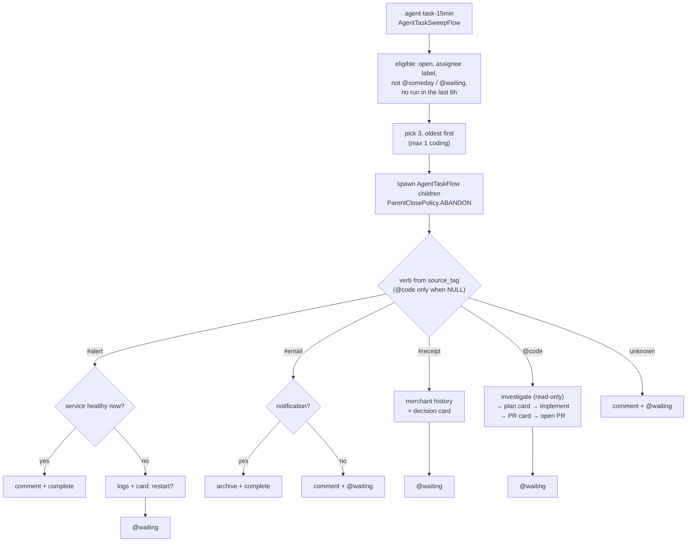
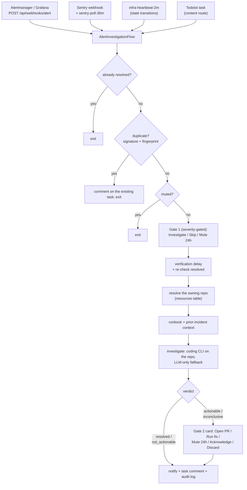

# How AEGIS works — an operator's guide

This is the guide to *running* AEGIS: the mental model, what fires when, how the
agents decide things, and what to check when a run looks green but did nothing.
It assumes you have a working deployment — for setup see
[`development.md`](development.md) (from source) and
[`production.md`](production.md) (images + backing services), and for the full
component reference see [`architecture/overview.md`](architecture/overview.md).

Sections:

1. [The mental model](#1-the-mental-model)
2. [Agents and capability tags](#2-agents-and-capability-tags)
3. [What runs when](#3-what-runs-when)
4. [The GTD / Todoist model](#4-the-gtd--todoist-model)
5. [The agent task executor](#5-the-agent-task-executor)
6. [Human-in-the-loop: interactions](#6-human-in-the-loop-interactions)
7. [The alert pipeline](#7-the-alert-pipeline)
8. [Operating it](#8-operating-it)
9. [Extending it](#9-extending-it)
10. [Failure modes worth recognising](#10-failure-modes-worth-recognising)

## 1. The mental model

AEGIS is a small fleet of named agents running scheduled and event-driven
[Temporal](https://temporal.io) workflows over your own data — tasks, email,
money, knowledge, infrastructure — and asking you for a decision only when one
is actually needed. Three long-running services:

| Service | Package | What it does |
|---|---|---|
| **Core** | `aegis-core` (`core/`) | FastAPI API on :8080, serves the admin SPA, chat with tool calling, the Postgres+pgvector knowledge store, all connectors, and applies DB migrations on startup |
| **Worker** | `aegis-worker` (`worker/`) | The Temporal worker — every flow and activity, on task queue `aegis-main`; reconciles Temporal schedules from the `activities` table (`schedule_sync.py`) |
| **Comms** | `aegis-comms` (`comms/`) | Chat-channel bot + delivery server on :8081 (Slack Socket Mode); idles as a no-op until Slack is configured — the admin **Interactions** inbox always works |

Behind them: **Postgres 16 + pgvector** (the only durable store), **Temporal**
(workflow orchestration, UI on :8233), and an LLM backend resolved through
`fast` / `balanced` / `smart` tiers (`config/models.yaml`, configured live on
the admin **Models & Providers** page).

**Why Temporal instead of cron.** Most of what AEGIS does is not
fire-and-forget. A flow that finds an unhealthy service posts a card asking
"restart it?" and then *waits* — possibly for days — before acting on your
answer. A cron job that asks a question and exits loses the question. A
Temporal workflow is durable state: it survives worker restarts and redeploys,
resumes exactly where it paused, retries individual activities with
per-activity policies, records a replayable history you can inspect in the
Temporal UI, and can spawn child workflows it deliberately does *not* wait for
(`ParentClosePolicy.ABANDON`) so one unanswered question never blocks the next
scheduled tick.

**Where configuration lives.** The DB, edited through the admin UI. The YAML
under `config/seed/` and the markdown under `personalities/` are first-boot
seeds only — after that, agents, personalities, channels, schedules,
integration secrets, and the infrastructure registry are all DB-owned, and
editing the files on a live install has no effect. The one env-side exception
is bootstrap: `AEGIS_DATABASE_URL`, admin credentials, `AEGIS_SECRET_KEY`
(encrypts every DB-stored secret — set it in production), and the Temporal/
comms endpoints.

## 2. Agents and capability tags

The shipped fleet (from `config/seed/agents.yaml`) is a working example — the
point of the project is that you replace it with your own:

| Agent | Role | Behavior tag |
|---|---|---|
| **Sebas** | Executive assistant — GTD, email, calendar, reviews | `gtd` |
| **Raphael** | Research and knowledge — briefings, ingest, scans | `research` |
| **Maou** | Finance — receipts, recurring charges, market data | `finance` |
| **Pandora's Actor** | Infrastructure — alerts, swarm/k8s, coding runs | `infra` |

(There is also an inactive virtual `system` agent that only exists to satisfy a
foreign key for system-level dispatch logging — never delete it, never chat
with it.)

**Nothing branches on an agent's id.** Behavior is keyed on
`agents.capabilities` — a JSONB list of tags from the closed vocabulary in
`core/src/aegis/agent_tags.py`: `gtd`, `finance`, `research`, `infra`. Code
that needs "the finance agent" calls `services/agents.py::resolve_tag`
(core) or the `AgentRegistryActivities.resolve_agents` activity (worker —
workflows can't touch the DB). If no active agent holds a tag, the feature
**skips with a logged warning** rather than crashing — which is also a failure
mode to know about (see [§10](#10-failure-modes-worth-recognising)).

Per-agent routing knobs live in `agents.metadata`:

| Key | Effect |
|---|---|
| `intent_keywords` / `intent_description` | chat message routing to this agent |
| `mention_aliases` | how the agent is @-addressed in chat, Slack, and Todoist labels (default `[id]`) |
| `tool_set` | which chat tools this agent may call |
| `async_dispatch` | Slack replies dispatched async vs inline |
| `knowledge_domains` | RAG result boosting for this agent |
| `voice_lines` | optional TTS persona lines |

**To add or re-point an agent:** create it on the admin **Agents** page (or
`POST /api/agents`), write its persona, then on the **Behavior** tab tick the
capability tags and pick the tool set. No code changes — every tag-driven
feature (reviews, briefings, money processing, alert investigation, Slack
@-addressing) follows the tags automatically.

Two ownership rules that bite people:

- `capabilities` and `metadata` are **DB-owned once non-empty**. The seed YAML
  applies on first boot and merges *new* metadata keys on upgrade, but a new
  capability tag added to the YAML does **not** retroactively apply to an
  existing deployment — tick it once in the Behavior tab.
- `metadata.tool_set` in the DB **overrides** the `AGENT_TOOL_SETS` dict in
  `core/src/aegis/services/chat.py` at runtime. That dict is only a seed-time
  default for the four example agents; an agent with no configured tool set
  falls back to a minimal read-only `_FALLBACK_TOOL_SET`. So "I added the tool
  to the Python dict and nothing changed" almost always means the DB row won.

## 3. What runs when

The `activities` table drives Temporal schedules: on startup and every ~300s,
`schedule_sync` (worker) reconciles Temporal's schedule list against active
rows — create, update, delete orphans. The schedule id **is** the
`activities.slug`. Because the reconcile loop fingerprints each schedule's
config, an edit to `activities.config` (admin **Flows** page, or
`PATCH /api/admin/activities/{slug}`) **propagates to the live schedule within
~5 minutes, no redeploy**.

The shipped schedule set (`config/seed/activities.yaml` — all crons UTC):

**Minutes-cadence**

| Slug | Cron | Flow | Agent | What it does |
|---|---|---|---|---|
| `infra-heartbeat-2m` | `*/2 * * * *` | `InfraHeartbeatFlow` | Pandora's Actor | Polls swarm nodes + services; spawns an investigation on **state transitions only**, so steady state costs nothing |
| `todoist-sync-5min` | `*/5 * * * *` | `TodoistSyncFlow` | Sebas | Incremental Todoist Sync API pull + drains the `todoist_outbox` write queue |
| `social-publish-5min` | `*/5 * * * *` | `SocialPublishFlow` | Sebas | `@publish`-labelled tasks due now → approval card → post. Ships **inert**: `social_publishing_enabled` defaults to false |
| `gtd-clarify-15min` | `*/15 * * * *` | `ClarifyFlow` | Sebas | Classifies unprocessed Inbox tasks (≤ 20 per tick) |
| `llm-spend-guard-15min` | `*/15 * * * *` | `LLMSpendGuardFlow` | Pandora's Actor | Rolling-24h token budget → flips the LLM kill switch. **Inert** until a budget is set (defaults to 0) |
| `agent-task-15min` | `*/15 * * * *` | `AgentTaskSweepFlow` | Pandora's Actor | Executes agent-assigned Todoist tasks — see [§5](#5-the-agent-task-executor) |
| `sentry-poll-30m` | `*/30 * * * *` | `SentryPollFlow` | Pandora's Actor | Sentry issue poll — safety net behind the webhook fast path |

**Hourly / few-hourly**

| Slug | Cron | Flow | Agent | What it does |
|---|---|---|---|---|
| `gmail-ingest-hourly` | `0 * * * *` | `GmailIngestFlow` | Sebas | Fetch + classify new mail; tag fan-out spawns `MoneyProcessFlow` for `financial`/`payments` mail |
| `delivery-watchdog-hourly` | `0 * * * *` | `DeliveryWatchdogFlow` | Pandora's Actor | Finds interaction cards that were never delivered; checks comms liveness |
| `rss-ingest-hourly` | `30 * * * *` | `RssIngestFlow` | Raphael | RSS feeds → knowledge store |
| `raindrop-ingest-2h` | `0 */2 * * *` | `RaindropIngestFlow` | Raphael | Raindrop bookmarks → knowledge store |
| `service-drift-4h` | `0 */4 * * *` | `ServiceDriftFlow` | Pandora's Actor | Secondary swarm drift check (alertmanager is the primary path) |
| `drive-sync-raphael` | `15 */4 * * *` | `DriveSyncFlow` | Raphael | Watched Google Drive folder → knowledge. **No-ops until `folder_id` is set** in its config |

**Daily**

| Slug | Cron (UTC) | Flow | Agent | What it does |
|---|---|---|---|---|
| `gtd-daily-review` | `30 2 * * *` | `DailyReviewFlow` | Sebas | Daily GTD digest + acknowledgement card |
| `memory-reflection-nightly` | `0 3 * * *` | `MemoryReflectionFlow` | Sebas | Caps each agent's `agent_memory` at `keep` rows (default 50). With `consolidate: true` it first *proposes* a merge/retire plan and logs it — observe-only, it never writes |
| `social-metrics-daily` | `30 3 * * *` | `SocialMetricsFlow` | Sebas | Pulls post analytics into `social_outbox.metrics` |
| `cleanup-daily` | `0 4 * * *` | `CleanupFlow` | Pandora's Actor | Retention prune for unbounded ops tables |
| `daily-briefing-raphael` | `30 4 * * *` | `DailyBriefingFlow` | Raphael | The daily brief: interactions, activity, knowledge, market summary → your channel |
| `workspace-repo-sync-daily` | `0 5 * * *` | `WorkspaceRepoSyncFlow` | Pandora's Actor | Mirrors the coding host's workspace checkouts into `resources`; flags tracked repos with a missing AEGIS webhook |
| `calendar-ingest-daily` | `0 6 * * *` | `CalendarIngestFlow` | Sebas | Calendar events, 30-day horizon |
| `cert-radar-daily` | `0 7 * * *` | `CertRadarFlow` | Pandora's Actor | TLS expiry checks for the domains in its config — **replace the seed list with your own** |
| `expiry-radar-daily` | `25 7 * * *` | `ExpiryRadarFlow` | Sebas | Warns on anything in `life.expiring_items` (passport, visa, licence, insurance, warranty, medication, domain) crossing one of its `lead_days` thresholds. One Acknowledge card per threshold per expiry cycle — renewing an item (moving `expires_on`) re-arms them all. Add rows on the admin **Expiring Items** page; empty registry = silent |
| `intel-scan-hn` / `-news` / `-finance` | `0 7` / `30 7` / `0 8 * * *` | `IntelligenceScanFlow` | Raphael | Scores sources against your topics; ingests items ≥ `significance_threshold` |
| `money-hygiene-daily` | `0 9 * * *` | `MoneyHygieneDailyFlow` | Maou | Recurring-charge anomaly sweep + renewal radar over `finance.recurring_charge` |
| `curiosity-daily` | `30 9 * * *` | `CuriosityCardFlow` | Sebas | At most one `input` card per day asking about a gap in what AEGIS knows (an unexplained recurring charge, a busy project, a recurring meeting face); the answer is banked as durable `agent_memory`. Gates itself on the notification budget, so a quiet day is the normal outcome. **The calendar-attendee lane stays off until you fill in Integrations → Owner (`owner_emails`)** — Google lists you among your own events' attendees, so without it the card could ask you who *you* are |
| `daylog-nightly` | `0 19 * * *` | `DayLogFlow` | Raphael | Files the day as one dated knowledge entry (`aegis://daylog/<date>`, `source_type='daylog'`) so retrieval has a timeline. 19:00 UTC = 00:30 IST, i.e. just after the IST day closes |

**Weekly / monthly**

| Slug | Cron (UTC) | Flow | Agent | What it does |
|---|---|---|---|---|
| `gtd-weekly-review` | `30 3 * * 0` | `WeeklyReviewFlow` | Sebas | Weekly review digest (Sunday) |
| `receipt-ingest-weekly` | `0 5 * * 0` | `ReceiptIngestFlow` | Maou | 14-day receipt safety net behind the hourly tag fan-out |
| `subscription-audit-monthly` | `0 10 1 * *` | `SubscriptionAuditFlow` | Maou | Monthly subscription audit digest |
| `daylog-weekly` | `20 20 * * 0` | `DayLogFlow` (`mode: weekly`) | Raphael | Condenses the ISO week's day logs into one `aegis://daylog/week/<iso-week>` entry (`source_type='daylog_rollup'`). Sunday, after that day's own 19:00 nightly entry |
| `daylog-monthly` | `20 21 28-31 * *` | `DayLogFlow` (`mode: monthly`) | Raphael | Same for the calendar month → `aegis://daylog/month/<yyyy-mm>`. Cron has no last-day operator, so it fires on 28-31 and the flow drops every run but the real month end |

Not in this table because they're **event-driven, not scheduled**:
`InteractionFlow` (spawned by any flow needing a decision),
`AlertInvestigationFlow` (webhooks + pollers, [§7](#7-the-alert-pipeline)),
`MoneyProcessFlow` (per-email child), `AgentChatReplyFlow` (Todoist comment
replies), `AgentTaskFlow` (per-task child of the sweep), and `GitHubAlertFlow`
(GitHub PR webhook notifier).

Note the **ship-active-but-inert** pattern: `social-publish-5min`,
`llm-spend-guard-15min`, and `drive-sync-raphael` are all `active: true` but
gated on a settings/config value that defaults to off. Their runs complete
green while doing nothing until you flip the gate — deliberate, but easy to
misread ([§10](#10-failure-modes-worth-recognising)).

## 4. The GTD / Todoist model

**Todoist is the canonical task store.** AEGIS mirrors it into Postgres every 5
minutes (`todoist-sync-5min`, incremental `sync_token`) and writes back through
a durable outbox (`todoist_outbox`), so AEGIS-side writes survive API blips.

The structure AEGIS manages is deliberately minimal:

- **The only managed container is the native Inbox.** AEGIS adopts Todoist's
  built-in Inbox (`settings.todoist_managed_project_ids` maps just `inbox`);
  it creates no projects of its own. Your work-area projects are yours —
  AEGIS reads them but never reorganises them.
- **GTD state lives in labels**, not projects: `@next` (actionable),
  `@someday` (not yet), `@waiting` (blocked / parked), `@reference`
  (information, ingested into the knowledge store).
- **Delegation is an assignee label**: `@me` or an agent alias
  (`@sebas`, `@raphael`, `@maou`, `@pandora` in the shipped set — derived from
  each agent's `mention_aliases`, not hardcoded). Commenting on an
  agent-labelled task gets you a personality-voiced reply on the task and in
  the agent's channel (`AgentChatReplyFlow`).
- Context labels (`@5min`, `@deep`, `@code`, …) and pre-seeded filter views
  come from `config/seed/todoist.yaml` at bootstrap.

`ClarifyFlow` (every 15 min) pulls **only** from the Inbox and classifies each
unprocessed task — trash / reference / someday / 2-minute / next-action —
applying the outcome as labels, completion, or a spawned follow-up flow. Its
watermark (`todoist_tasks.last_clarified_at`) only advances on a real terminal
state, so a transient failure leaves the task eligible for the next tick. The
clarify rules are the `_RuleSet` class in
`worker/src/aegis_worker/activities/clarify.py` — there is no external rules
engine to configure.

**Why `@waiting` matters more than it looks.** It is the universal *parking
state*: every scanner that selects tasks by label — clarify eligibility, the
agent task executor's `find_actionable_tasks` — **excludes** `@waiting`.
Parking a task is what removes it from the machine's field of view while
keeping it visible to you (the seeded "⏳ Waiting For" filter). Without that
exclusion, a task the executor can't finish would be re-picked every cooldown
window forever ([§5](#5-the-agent-task-executor)). If a task seems ignored by
AEGIS, check whether something parked it.

## 5. The agent task executor

The newest subsystem (design:
[`superpowers/specs/2026-07-30-agent-task-executor-design.md`](superpowers/specs/2026-07-30-agent-task-executor-design.md)).
Most agent-assigned tasks in Todoist are AEGIS's *own* triage output — alert
tasks, receipt anomalies, email actions. The executor is what finally acts on
them, instead of letting them accumulate.

Two flows in `worker/src/aegis_worker/flows/agent_task.py`, mirroring the
`SentryPollFlow` → `AlertInvestigationFlow` split:

- **`AgentTaskSweepFlow`** (`agent-task-15min`) selects eligible tasks and
  spawns one **abandoned** child per task. It never awaits them — a child can
  sit on an approval card for days, and Temporal schedules default to
  overlap=SKIP, so awaiting would let one unanswered card starve every later
  tick.
- **`AgentTaskFlow`** — one run per task, resolves a verb and executes it.

**Eligibility:** open task in *any* project, carrying an agent assignee label,
**no due date required** (triage output rarely has one). Excluded: `@someday`,
`@waiting`, completed. **The brake:** 3 tasks per tick, oldest first; a 6-hour
per-task cooldown (keyed on `workflow_runs.todoist_task_ref`, which the run
recorder populates automatically from the flow input's `todoist_task_id`
field); at most 1 coding task per tick. A large backlog drains over days
rather than stampeding. All four knobs are `activities.config` keys
(`max_tasks`, `cooldown_hours`, `max_coding`) — editable live.

**Verb resolution** comes from the task's `source_tag` (who captured it);
`@code` is consulted only when `source_tag` is NULL, i.e. the task is
user-authored:

| Selector | Verb | What happens |
|---|---|---|
| `source_tag = '#alert'` | infra | Check the service's health *now* (not the alert history) → healthy: comment + complete; unhealthy: logs + a "restart?" card |
| `source_tag = '#receipt'` | finance | Assemble the merchant's charge history → decision card ("Expected / Investigate"). No autonomous action |
| `source_tag = '#email'` | email triage | Notification → archive + complete; genuinely needs a reply → comment + `@waiting` (the Gmail scope is `gmail.modify` — AEGIS cannot send mail) |
| `source_tag IS NULL` + `@code` | coding | Two-phase coding run: read-only investigation → plan card → implement on a branch → PR card → open PR |
| anything else | — | Comment "no executor for this" + park. Never guessed at |



**The safety model:** investigation is free; every write is gated by an
`InteractionFlow` card. Reading service logs, repo code, charge history, email
metadata, and commenting findings on the task — no gate. Restarting a service,
implementing code, opening a PR, applying a finance decision — card first.
Restart/finance cards use the fire-and-forget `post_resolve_activity` hook
(`apply_restart_approval` / `apply_finance_decision`), so the child can park
the task and exit while the card is still open; the coding flow instead awaits
its plan/PR cards directly (safe, because the child itself is abandoned).

**Every path ends completed or parked.** A task is auto-completed only when
the work is genuinely done (service healthy, notification archived);
everything a human still has to finish — an open PR, a declined restart, a
reply-needed email — ends at `@waiting` with an explanatory comment. Even a
crashed child best-effort parks the task before re-raising. That invariant is
what keeps the 6h cooldown from becoming an infinite slow loop over the same
tasks. Related invariant: every agent-authored task comment carries a
`Workflow run:` footer, which is what clarify's eligibility filter uses to
ignore AEGIS's own comments — a comment without it would look like fresh user
input and re-trigger clarify every 15 minutes.

## 6. Human-in-the-loop: interactions

`interactions` is the *only* human-handoff primitive — there are no
per-domain decision tables, and new flows should not invent one. Any flow that
needs an answer spawns `InteractionFlow`
(`worker/src/aegis_worker/flows/interaction.py`) as a child workflow:

```
parent flow
  └─ InteractionFlow child
      ├─ inserts an `interactions` row (status='pending')
      ├─ delivers a card via comms → your Slack channel (if configured)
      │    …and always to the admin Interactions inbox
      └─ awaits the `submit_response` signal
           ├─ Slack button tap ─┐
           ├─ admin UI click  ──┼→ POST /api/interactions/{id}/resolve → signal
           └─ timeout → apply timeout_policy
```

**Card kinds:** `approval` (binary), `choice` (one of N), `input` (free
text), `draft_review` (edit-and-submit), `ack` (single acknowledge button).
Anything else renders with no action buttons — a silent way to make a card
unanswerable, so stick to the five.

**Timeout policies:** `archive` (default — the row becomes `archived`, the
flow returns status `archived`, and the parent decides what "no answer" means)
or `hold` (no deadline; the flow blocks until answered — used where a wrong
default would be worse than waiting). If you need "timeout = soft-reject",
use `archive` and treat `archived` as a rejection in the parent.

**`post_resolve_activity`** is the fire-and-forget hook: the card's spawner
can exit immediately (abandoned child) and still have an action run when you
eventually answer — the named activity is invoked with
`[interaction_id, response, metadata]`. This is how a restart approval
executes hours after the flow that asked went away.

Two extras worth knowing: cards can carry an **escalation** config in
`metadata` (`{"escalation": {"interval_minutes": N, "mention_id": "…",
"max_repeats": N}}`) that re-pings with an @-mention until answered — used for
critical infra cards; and approval/choice/ack cards include an optional
free-text **note** field — a note typed alongside your tap is recorded as a
durable `agent_memory` lesson surfaced in that agent's future prompts (the
learning loop).

## 7. The alert pipeline

Every alert source converges on one flow — `AlertInvestigationFlow` — so
dedup, muting, approval gates, and the audit trail behave identically
regardless of where the alert came from:

- `POST /api/webhooks/alert` — Grafana / Alertmanager-shaped payloads
- `POST /api/webhooks/sentry` — Sentry's webhook (fast path), backed by
  `sentry-poll-30m` (safety net)
- `infra-heartbeat-2m` — AEGIS's own 2-minute swarm poll; investigates on
  node/service **state transitions** only, and catches outages that also take
  your alerting stack down
- Hand-captured Todoist tasks routed via a content route with
  `alert_overrides` (e.g. "X is down" → a synthetic `NodeDown`)

(`POST /api/webhooks/github` is separate: `GitHubAlertFlow` only posts PR
notification cards for repos tracked in `resources` — it does not
investigate.)



The steps that make it trustworthy:

- **Dedup, twice.** A signature index collapses variations of the same failure
  class (Sentry stack-frame noise → `sentry-class:<service>:<type>`); if an
  open alert task with the same signature exists, the new occurrence becomes a
  comment on it, not a new investigation. A fingerprint check against
  `audit_log` catches exact re-fires. Recovery events **re-arm** dedup, so a
  class that flapped and recovered still gets a fresh investigation next time.
- **Mutes** (`alert_mutes`) short-circuit early — "Mute 24h" on a card writes
  one.
- **Verification delay.** A per-severity sleep and a resolved re-check before
  spending any investigation effort — self-healing blips cost nothing.
- **Repo resolution.** Deterministic service-name matching, then an LLM pick,
  against the `resources` table — which `workspace-repo-sync-daily` keeps
  mirroring your coding host's actual checkouts. No JIT cloning: a repo AEGIS
  doesn't have checked out falls back to LLM-only investigation.
- **Context.** `runbooks/<AlertName>.md` (baked into the worker image;
  `TODO: fill in` stubs are treated as absent) plus prior-incident context
  from the knowledge store.
- **Investigation** runs your coding CLI (Claude Code / Kimi) over SSH on the
  registered coding host against the resolved repo, LLM-only as fallback, and
  ends in a structured verdict: `resolved` / `not_actionable` / `actionable` /
  `inconclusive`.
- **Gate 2** puts every consequential outcome behind a card: open the
  proposed PR(s), **Run fix** (execute the investigation's proposed commands
  on the host — refused when the infra registry entry is `read_only`; a typed
  note overrides the command list), mute, acknowledge, or discard.

Everything lands as a comment trail on a `@pandora`-labelled Todoist task plus
an `audit_log` row, so the incident history lives where you already look.
Escalation @-mentions and a dead-man ping URL for the heartbeat are configured
on the admin **Integrations** page. See
[`production.md`](production.md#alert-routing-inbound-webhooks) for webhook
setup and the heartbeat/dedup invariants.

## 8. Operating it

Recipes assume the compose/stack from the repo; substitute your own hostnames.

**Trigger a scheduled flow now.** Schedule ids equal `activities.slug`:

```bash
temporal schedule trigger --schedule-id gtd-clarify-15min \
  --address <temporal-host>:7233
```

or open the Temporal UI (`http://<temporal-host>:8233` → Schedules → the slug
→ Trigger). From chat, an agent holding the `trigger_workflow` tool can start
any registered workflow type by name.

**Did it actually do anything?** Every run lands in `workflow_runs` via the
worker's run-recorder interceptor:

```sql
SELECT workflow_type, status, started_at, duration_ms, result_summary
FROM workflow_runs
ORDER BY started_at DESC
LIMIT 20;
```

`status='completed'` means the *workflow* finished — read `result_summary` to
see whether it did real work: `{"found": 0, "spawned": 0}` from a sweep is a
completed no-op; `{"reason": "...", "exception_type": "..."}` is a recorded
failure (the flow convention raises
`ApplicationError("<flow>_failed at step=X: ...")`, so the failing step is in
the reason). Temporal's own UI keeps ~24h of history; `workflow_runs` is the
long-term record.

**What's waiting on me?** The admin **Interactions** inbox, or:

```sql
SELECT id, agent_id, kind, origin, left(prompt, 80) AS prompt, created_at
FROM interactions
WHERE status = 'pending'
ORDER BY created_at;
```

**Why didn't something fire?** In order:

1. Is the `activities` row `active` and its cron right? (Admin **Flows** page.)
2. Does the schedule exist in Temporal? (UI → Schedules. A missing schedule
   with a `schedule_unknown_type` warning in worker logs means the flow's
   `_ACTIVITY_TYPE_MAP` entry is missing.)
3. Was the tick **skipped**? Schedules default to overlap=SKIP — a
   still-running previous run silently swallows ticks. The schedule detail
   page shows recent actions.
4. Did it run and no-op? Check `result_summary` as above, and whether the
   flow is gated by a setting (§3's inert list) or by a capability tag with
   zero holders (worker logs a warning).

**Where logs live.** Wherever your orchestrator puts container stdout —
`docker compose logs worker -f` locally, `docker service logs <stack>_worker`
on Swarm. All three services log structured JSON; with `OTEL_ENABLED=true`
each line carries `trace_id`/`span_id` and traces export via OTLP.
Chat-visible health: the `system_status` tool and
`GET /api/admin/system/status`; comms inbound liveness is `GET /api/health`
on :8081, and `delivery-watchdog-hourly` will capture a Todoist task if the
chat channel itself is down. LLM ground truth is the `llm_calls` table (every
call, with tokens and latency); connector ground truth is `connector_calls`.

## 9. Extending it

**A new scheduled flow** — four registration points, and *nothing is
auto-discovered* (full steps in
[`development.md`](development.md#adding-a-new-flow)):

1. The flow (`@workflow.defn`) in `worker/src/aegis_worker/flows/` and its
   activities in `activities/`. The config dataclass **must** have
   `agent_id: str` as its first field — the run recorder reads it.
2. Register **both** the workflow and the activities in
   `worker/src/aegis_worker/__main__.py` — two separate explicit lists, and
   updating only one is a boot regression that has happened before.
3. Add an `_ACTIVITY_TYPE_MAP` entry in
   `worker/src/aegis_worker/schedule_sync.py`, keyed by the PascalCase class
   name, mapping an `activities` row to the flow's config dataclass.
4. Seed a row in `config/seed/activities.yaml`. `schedule_sync` registers the
   Temporal schedule on the next worker start and reconciles every ~5 min.

For any human decision inside the flow, spawn `InteractionFlow` — don't build
custom callback plumbing.

**A new chat tool** — schema into `CHAT_TOOLS`, executor into
`TOOL_EXECUTORS` (both `core/src/aegis/services/chat.py`), then **grant it
via `metadata.tool_set`** — a DB write on the agent's Behavior tab (or seed
YAML for fresh installs), *not* a code change: the DB tool set overrides the
Python dict at runtime ([§2](#2-agents-and-capability-tags)). Core refuses to
boot on a tool set naming a tool with no executor, and warns on DB tool sets
referencing missing executors. Tools that can run past the default 30s
timeout need a `_TOOL_TIMEOUT_OVERRIDES` entry, or the executor cancels them
mid-flight and the model retries.

**A new connector** — `core/src/aegis/connectors/<name>.py` with async
methods, config fields in `core/src/aegis/config.py`, wired in
`worker/src/aegis_worker/bootstrap.py` (and onto `ToolContext` if chat tools
use it). See [`development.md`](development.md#adding-a-new-connector).

## 10. Failure modes worth recognising

The system's failure philosophy is "skip and log, never crash" — which means
its characteristic failure is *silence*, not noise. These are the shapes to
recognise:

**1. Completed but no-op — the signature failure.** A run finishes green
having done nothing. Causes: a feature gate still off (`social-publish-5min`
before `social_publishing_enabled`, `llm-spend-guard-15min` with a zero
budget, `drive-sync-raphael` with no `folder_id`), a capability tag with zero
active holders (feature skips with only a log warning), or simply nothing to
do. `workflow_runs.status` cannot distinguish these — **read the numeric
fields in `result_summary`**, and treat a flow that reports zeros for days as
a question, not an answer.

**2. "Success" wrapping a failed call.** Several external calls report
failure in their *return value*, not an exception: Todoist Sync API batches
return HTTP 200 with per-command `sync_status` (a rejected command inside a
green envelope); `create_github_pr` returns `{"status": "failed", "error":
…}` without raising; task comments are best-effort `{"ok": false}`. Flow code
checks these — but if you're extending AEGIS, this is the convention to
follow, and when auditing an odd outcome, check the return-value status
fields before trusting the run status.

**3. Silent LLM-tier outage.** If a tier's backend is broken (dead proxy,
blanked key, renamed model), symptoms are indirect: empty briefings,
clarify falling back to rules, chat degrading — while schedules keep
completing. `llm_calls` is the ground truth: no recent rows, or rows full of
errors, means the backend — check the admin **Models & Providers** page. A
related trap: reasoning models bill hidden thinking tokens against
`max_tokens`, so an over-tight cap yields `finish_reason=length` with empty
content — AEGIS raises `LLMTruncationError` rather than passing `""`
downstream, and you'll see that name in `result_summary.reason`.

**4. Editing the wrong config plane.** Seed YAML and Python defaults are
overridden by the DB on a live install: editing `config/seed/agents.yaml` or
`AGENT_TOOL_SETS` changes nothing until the DB row says so ([§2](#2-agents-and-capability-tags));
editing `personalities/*.md` after first boot does nothing. The reverse also
holds — a DB `activities.config` edit *does* take effect, within ~5 minutes,
which surprises people expecting a deploy step. When behavior doesn't match
the code you're reading, ask which plane owns that value.

**5. Skipped ticks behind a stuck run.** Overlap=SKIP means one long-running
or wedged run silently swallows every subsequent tick of its schedule. This
is why sweep-style flows spawn abandoned children instead of awaiting cards.
If a schedule "stopped", look for a still-running run of it first.

**6. The self-triggering comment loop.** Clarify treats any Todoist comment
without an AEGIS marker (`[ClarifyFlow @`, `[Agent reply @`, `Workflow
run:`) as user input. An agent-authored comment missing its footer re-spawns
processing every 15 minutes. If a task's comment thread is growing on its
own, this is what's happening — and the bug is in whatever wrote the
unmarked comment.

**7. Parking discipline.** Everything that ends "not done" must end at
`@waiting` ([§4](#4-the-gtd--todoist-model), [§5](#5-the-agent-task-executor)).
A task that keeps getting re-picked every 6 hours has an exit path that
forgot to park; a task that seems abandoned was parked and is waiting on
*you* — check its comments and the pending-interactions list.

Two operational rules from [`production.md`](production.md) round this out:
roll core and worker on the same commit (they share a schema; migrations
auto-apply on Core startup), and never expose :8080 without auth — Core
refuses to boot without admin credentials unless you explicitly disable auth
for a proxy-fronted deployment, and an auth-disabled instance announces
itself with a CRITICAL boot log line and a red admin-UI banner.
